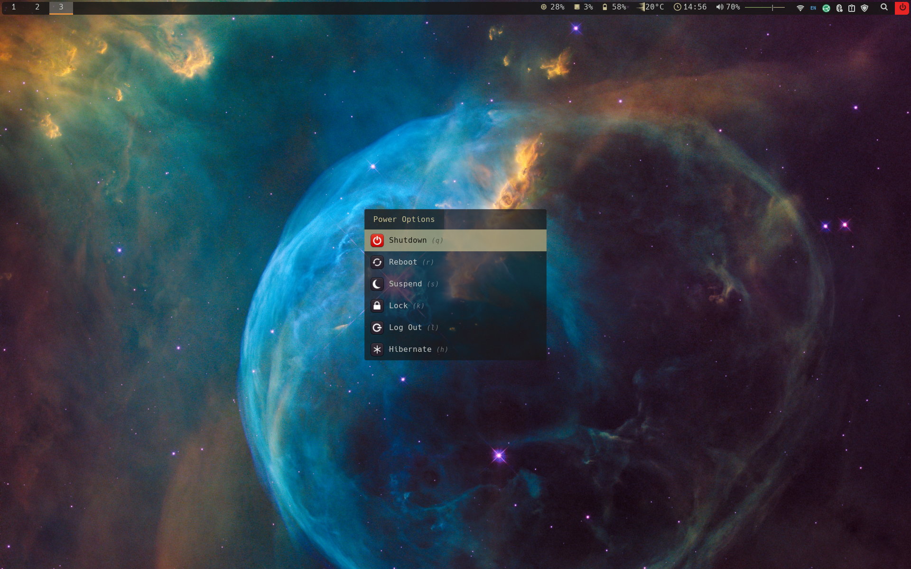
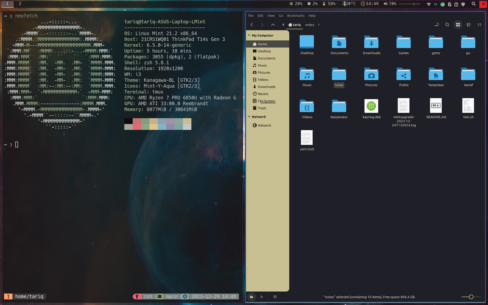
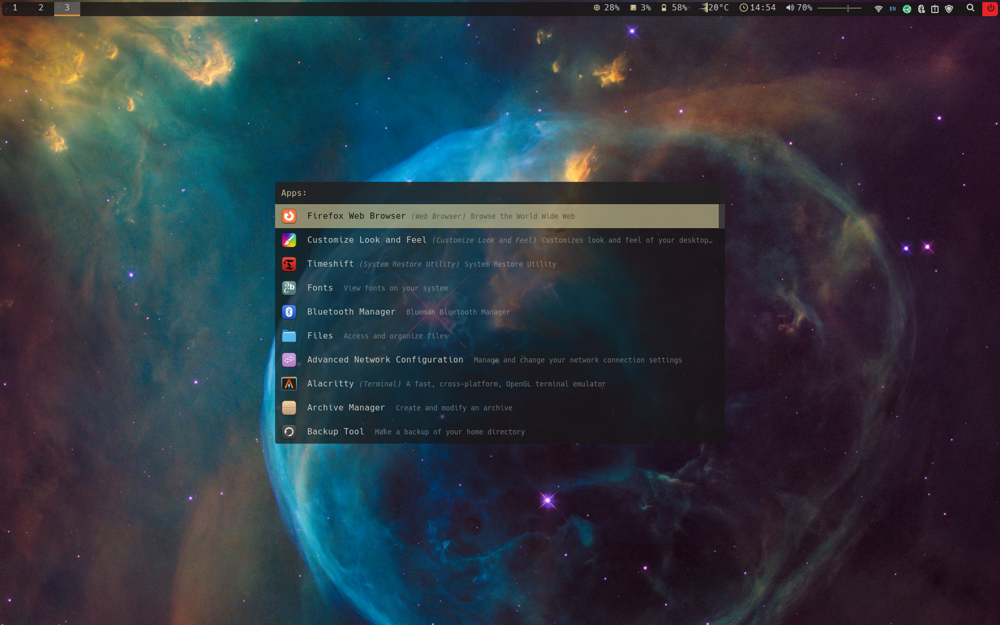
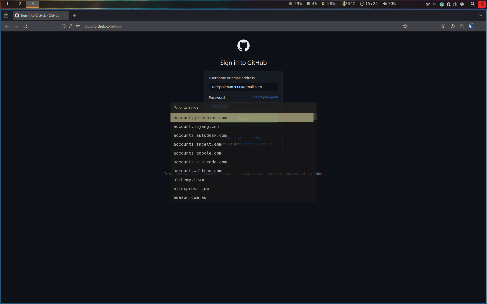

# Configuration Files \(dotfiles\)

This repo stores some of my useful configuration files \(commonly referred to as
dotfiles\) for a Linux machine.

# Screenshots

## Power Menu



## Terminal and File Browser



## App Launcher



## Password Manager Menu



# Migrating to a new system

One of the most useful parts of having version control for these config files is
that it is easy to migrate to a new system while maintaining configurations for
many popular applications. In order to do this, ~~follow this modified version
of [this](https://www.atlassian.com/git/tutorials/dotfiles) guide~~ I use
[GNU stow](https://www.gnu.org/software/stow/).

1. Install git and clone the repo. E.g if the `apt` package manager is available
   then use the following.

```
sudo apt install -y git && git clone git@github.com:TSoli/dotfiles.git ~/dotfiles
```

2. Use GNU stow to link the config files for whatever applications you install.

E.g for neovim the config files are stored in `nvim` so you would run

```sh
stow nvim
```

## Setup Scripts

**Note this is deprecated**

1. Now run `source ~/.bashrc` and then run the setup script with
   `~/.setup_scripts/debian_based/bash_setup.sh` \(note that this is for
   Debian-based distros such as Ubuntu\). This will install neovim and some
   package managers \(nvm, npm, yarn\) that are generally useful and needed for
   some of the plugins I use. It also installs some of the Hack
   [Nerd-Fonts](https://github.com/ryanoasis/nerd-fonts) which needs to be
   manually enabled for the terminal in order for some symbols to show.

# Troubleshooting

If it seems that `.zprofile` or `.zshrc` is not running properly on startup this
is likely due to the terminal not running as a login shell. Therefore, you may
need to change this setting in the terminal application itself.

It is also likely that the first time opening tmux the plugins will need to be
manually installed by pressing the prefix \(C-Space\) and then 'I' \(S-i\).

The system tray seems to be broken in polybar so you may need to build from
source to get a newer version.

## References

For Neovim setup I mostly followed
[this guide](https://www.youtube.com/playlist?list=PLhoH5vyxr6Qq41NFL4GvhFp-WLd5xzIzZ).

## TODO
